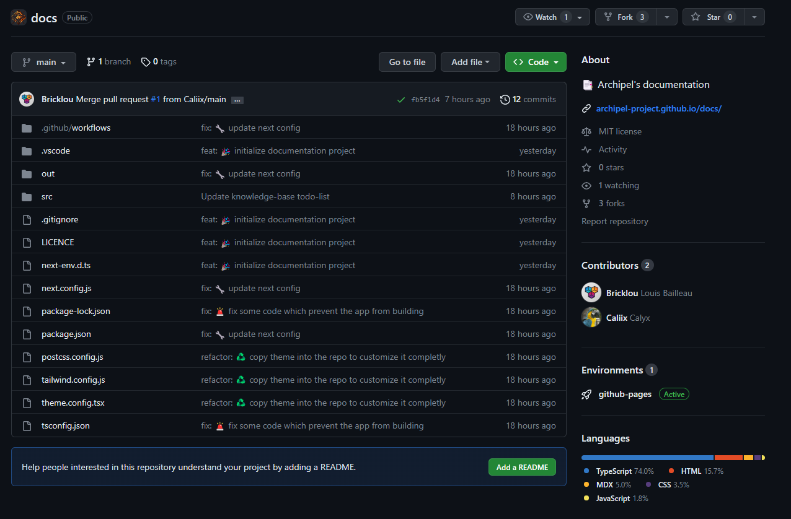
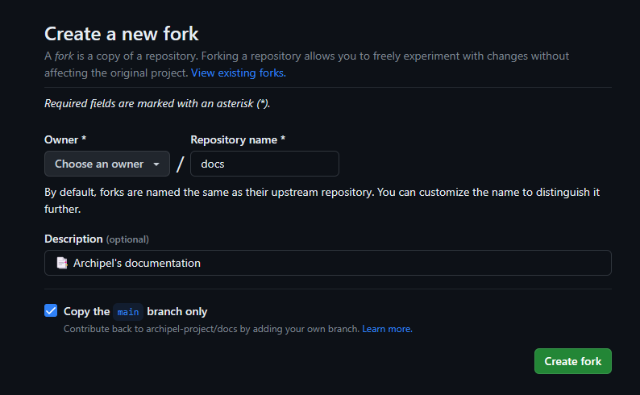

# Introduction

Bienvenue sur Archipel Project ! Ce site sert de base de connaissance pour rassembler toutes les informations et ressources nécessaire
au développement du projet.

## Qu'est ce qu'Archipel Project ?

TODO

## Où se trouve le projet ?

Le projet est hébergé sur [Github](https://github.com/archipel-project). Il est composé de plusieurs dépôts :

* [Proxy](https://github.com/archipel-project/archipel-proxy)
* [Manager](https://github.com/archipel-project/archipel-manager)
* [Core](https://github.com/archipel-project/archipel-core)
* [Storage](https://github.com/archipel-project/archipel-storage)
* [Tools](https://github.com/archipel-project/archipel-tools)
* [Documentation](https://github.com/archipel-project/docs)
* [Dev blog](https://github.com/archipel-project/dev-blog)

## Comment contribuer ?

Pour contribuer au projet [Archipel](https://github.com/archipel-project), vous devez [fork](https://docs.github.com/en/get-started/quickstart/fork-a-repo) ce qui vous permettra d'avoir le repository sur votre compte GitHub sur lequel vous pourrez effectuer tous les modifications que vous voulez. Une fois les modifications faites, vous devrez faire une [pull request](https://docs.github.com/en/pull-requests/collaborating-with-pull-requests/proposing-changes-to-your-work-with-pull-requests/about-pull-requests) qui sera analysée et si les modifications nous conviennent, elles seront [merge](https://docs.github.com/en/repositories/configuring-branches-and-merges-in-your-repository/configuring-pull-request-merges/about-merge-methods-on-github) sur notre GitHub.

### Exemple de contribution

Pour que les contributions soient plus simples, vous pouvez utiliser [GitHub Desktop](https://desktop.github.com) qui contient toutes les fonctionnalités de GitHub en CLI mais avec une interface graphique.

**Fork du repository**

Pour effectuer le fork, rendez-vous sur le repository qui vous interresse (ici [archipel-project/docs](https://github.com/archipel-project/docs)) et cliquez sur **Fork**.

Ensuite, cliquez sur **Create fork** et ensuite vous aurez le repository sur votre compte GitHub.

**Édition**

Une fois que vous avez le repository sur votre compte GitHub, [clonez-le](https://docs.github.com/en/repositories/creating-and-managing-repositories/cloning-a-repository?tool=cli). Après l'avoir cloné, ouvrez-le avec votre éditeur de texte/IDE (nous vous reccomandons [Visual Studio Code](https://code.visualstudio.com)). Effectuez vos modifications et faites un [commit](https://docs.github.com/en/pull-requests/committing-changes-to-your-project/creating-and-editing-commits/about-commits). Les commit doivent respecter les [conventions de nommage](https://www.conventionalcommits.org/fr/v1.0.0/).

**Exemple de commit**

`docs: Add contributions documentation`

Ce nom de commit signifie que les ajoute (feat) la documentation sur les contributions.

Le commit devrait se trouver sur votre compte GitHub. Si tel est le cas, effectuez une [pull request](https://docs.github.com/en/pull-requests/collaborating-with-pull-requests/proposing-changes-to-your-work-with-pull-requests/about-pull-requests).