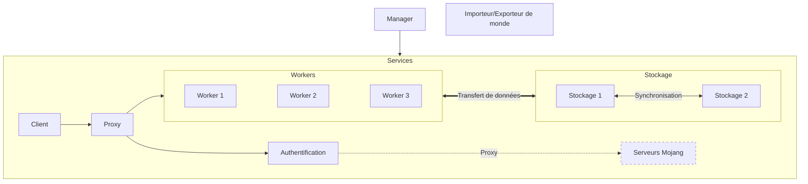

# Projets

Vous trouverez sur cette page les différentes parties nécessaires au bon fonctionnement du serveur.

## Librairies

### Librairie de paquets

Cette librairie sera en charge d'interpréter les paquets Minecraft et de les convertir vers un format compréhensible pour Rust et inversement.

### Librairie de communication

import { Callout } from 'nextra/components'

<Callout type="warning">
TODO !
</Callout>

## Outils

### Importeur/Exporteur de monde

Cet outil permettra d'importer et d'exporter des mondes Minecraft en les convertissant dans un format compréhensible par le serveur.

## Services

### Proxy

Le proxy est le point d'entrée pour les joueurs. Ils pourront accéder au serveur de jeu en se connectant dessus.
Ce proxy gérera la connexion des joueurs, leur authentification et s'occupera d'accéder au bon worker en fonction du monde demandé.

### Authentification

Le service d'authentification aura 3 modes de fonctionnement :
- en mode proxy : il authentifiera les joueurs via les serveurs de Mojang
- en mode local : il authentifiera les joueurs via une base de données locale ainsi que les serveurs de Mojang
- en mode offline : il authentifiera les joueurs via une base de données locale sans vérifier les serveurs de Mojang (mode hors ligne)

### Stockage des mondes

Le serveur de stockage est une base de données qui stockera le monde du serveur et il sera accessible par les workers.
Ce serveur pourra être clusterisé pour permettre une meilleure répartition de la charge et ainsi prévenir les pannes.

### Worker

Le worker est le serveur de jeu, c'est lui qui fait toute la logique du jeu. Il est accessible via le proxy et récupère les données du monde via le serveur de stockage.
Chaque worker prends en charge une à plusieurs dimensions. 
jeu de base au complet (overworld, nether, end).

### Manager

Le manager sera là pour chapeauter les différents services et garder une cohésion. C'est par le biais de ce dernier qu'il sera possible de gérer l'infrastructure du serveur
(joueurs, mondes, nodes, backups, etc.).

### Client

Le client est un outil graphique que nous allons développer pour nous aider à analyser la stack réseau des serveurs Minecraft ainsi que des données qui transitent avec le client.
Cela nous permettra de mieux comprendre le fonctionnement du jeu et de pouvoir développer plus facilement la logique du jeu.

## Diagramme de relation des services

